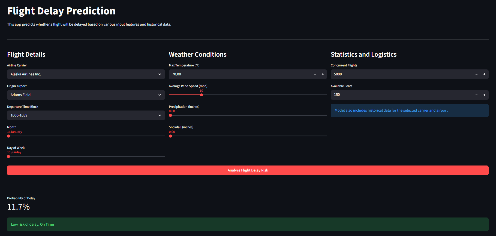

# US Flight Delay Predictor

An end-to-end Machine Learning solution designed to estimate the probability of US domestic flight departures being delayed by more than 15 minutes. This project leverages the XGBoost algorithm and was trained on a massive dataset of over 6 million flight records.

Try the Live App: https://us-flight-delay-predictor.streamlit.app

---

## Project Structure

### train_model.py
This script handles the entire machine learning pipeline. It performs the following operations:
* Data Loading: Processes the full training dataset (train.csv) including logistical and meteorological features.
* Preprocessing: Implements Label Encoding for categorical variables (Carrier, Airport, Time Block) and handles unseen labels in the test set.
* Model Training: Utilizes the XGBClassifier with 700 estimators and a depth of 10. It automatically calculates `scale_pos_weight` to handle the class imbalance between on-time and delayed flights.
* Optimization: Performs a threshold grid search (0.30 to 0.70) to maximize the F2-Score while ensuring global accuracy remains above 0.70.
* Serialization: Saves the trained model, encoders, and feature names as .pkl files for production use.

### app.py
The web-based user interface built with Streamlit. It allows users to:
* Input flight details (Carrier, Origin Airport, Date, Time Block).
* Provide weather conditions (Temperature, Wind, Precipitation, Snow).
* View real-time probability estimates and risk assessments generated by the XGBoost engine.

## Technical Stack
* Core Engine: XGBoost (Extreme Gradient Boosting)
* Deployment: Streamlit Cloud
* Data Processing: Pandas, NumPy, Scikit-learn
* Model Serialization: Joblib

## Model Engineering and Strategy
The project focuses on business utility by prioritizing the detection of actual delays:

* F2-Score Optimization: The engine is tuned using the F2-Score (beta=2) to prioritize Recall over Precision. In aviation logistics, predicting a delay that actually occurs is more valuable than avoiding a false alarm.
* Handling Class Imbalance: The model uses the scale_pos_weight parameter to account for the minority class, as delayed flights represent a smaller fraction of the total dataset.
* Feature Integration: The model incorporates carrier-specific and airport-specific historical delay trends alongside real-time weather data.

## Performance Metrics
* Global Accuracy: ~71%
* Recall (Delay Detection): ~61%
* Decision Threshold: Optimized via F2-Score maximization (typically around 0.40 - 0.50)

---

## Local Setup and Installation

Follow these steps to run the predictor on a local machine:

### 1. Clone the repository
```bash
git clone https://github.com/MichalAntosiewicz/Flight-Delay-Predictor
cd Flight-Delay-Predictor
```
### 2. Install dependencies
```bash
pip install -r requirements.txt
```
### 3. Run the Streamlit application
```bash
streamlit run app.py
```

---

## Dataset Reference
This project is built using the 2019 Airline Delays and Cancellations dataset. The data was 
originally compiled by the U.S. Bureau of Transportation Statistics (BTS) and contains 
comprehensive records of flight performance, weather impacts, and airport traffic patterns across the United States.

Link: https://www.kaggle.com/datasets/threnjen/2019-airline-delays-and-cancellations

---

## Project Overview

